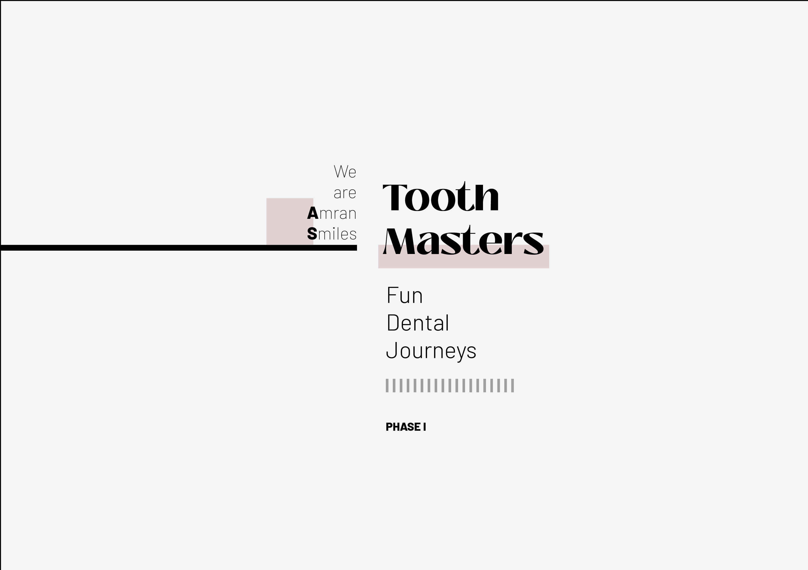

# Dental Platform Project

## Introduction
Post-bootcamp, I built a dental platform using design tools, Figma and Photoshop, and for front end HTML, CSS, and JavaScript.

## Project Definition
As part of the development of the design brief Researching the dental industry was vital in identifying issues and leveraging technology to address them. The book “Delivering a Sustainable Dental Practice.” was highly influential in this process outlining the responsibility dental practices have in making their methods more sustainable through remote patient engagement. This lead me to defining the project in two phases, phase 1 is to create a user-friendly and visually appealing homepage that sets the tone for the sustainable dental website. And phase 2 incorporates interactive features for accountability and patient support.

## User Experience
In this section, I walked through a dental patient's experience on insialign. (Detailed patient journey follows)

## Content Organization
Given the website is intended for users to seek help during conflicting times in their treatment, organizing content and functionalities that made sense to the user was crucial, as well as taking into consideration first-time visitors, returning patients, and dental professionals. This helped me prioritize the most important elements on the site, like appointment scheduling, treatment information, and dentist profiles.

## Platform Demo
Now to give a demo on the website starting from the homepage. (Detailed platform demo follows)

## Development Process Review: Phase 1
Reviewing the development process of phase 1, a challenge I faced was getting the selected date from the calendar component to appear on the appointment details side of the webpage which needed proper synchronization and data transfer between the calendar component and the target display area.

## Learning and Improvement
From googling how, to also reaching out to difference sources which were my bootcamp friends, developers from Instagram, and stack overflow, the different sources brought unique perspectives and exposed a wide range of ideas and solutions to tackle the problem. This allowed me to evaluate different approaches and choose the best approach to my context in my opinion which was attaching event listeners to the calendar's date elements and storing the selected date in a variable.

## Future Work: Phase 2
What I would do differently for phase 2 is implement using Git to track code changes and maintain a history of the project. This would really help in identifying the source of bugs and streamlining the debugging process. For instance, I encountered an issue where the “Book Now” button failed to enable correctly when both treatment and time were selected. By utilizing version control, I could have quickly pinpointed the specific code changes that led to this issue, allowing for prompt bug resolution and an overall smoother development experience.

